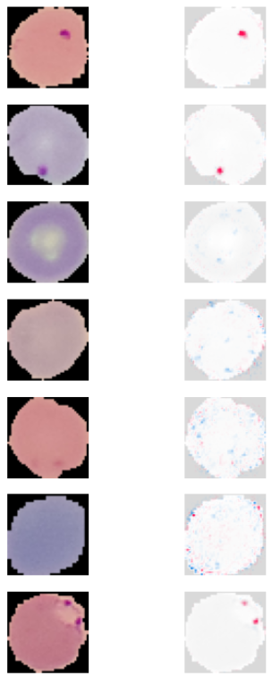
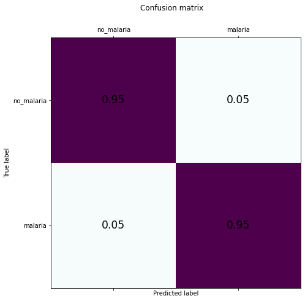
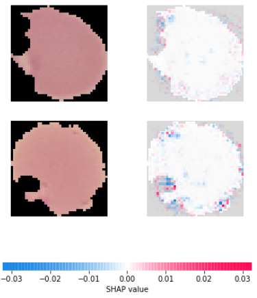
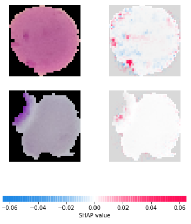

<div class="cell markdown" data-collapsed="false" data-pycharm="{&quot;name&quot;:&quot;#%% md\n&quot;}">

### Malaria cell prediction

This projects tries to predict if a cell is malaria parasitized or
uninfected. The prepared dataset is from
[Kaggle](https://www.kaggle.com/iarunava/cell-images-for-detecting-malaria).

The task is to build a neural network that predicts a cell image with a
high recall.

<div class="output display_data">



</div>

</div>

<div class="cell code" data-execution_count="1" data-collapsed="true">

``` python
import numpy as np
from sklearn.model_selection import train_test_split
import os
from keras.preprocessing import image
from tensorflow.python.keras.callbacks import EarlyStopping
from tqdm import tqdm
import tensorflow as tf
import matplotlib.pyplot as plt
from sklearn.metrics import confusion_matrix
import shap
```

</div>

<div class="cell markdown" data-collapsed="false" data-pycharm="{&quot;name&quot;:&quot;#%% md\n&quot;}">

Data is saved locally but it is the orginial folder structure from
Kaggle.

</div>

<div class="cell code" data-execution_count="2" data-collapsed="false" data-pycharm="{&quot;name&quot;:&quot;#%%\n&quot;}">

``` python
parasitized_path = "D:\KI_Dataset\Malaria_images\cell_images\Parasitized"
uninfected_path = "D:\KI_Dataset\Malaria_images\cell_images\Uninfected"
```

</div>

<div class="cell code" data-execution_count="3" data-collapsed="false" data-pycharm="{&quot;name&quot;:&quot;#%% collect images from the folders\n&quot;}">

``` python
def collect_images(path,target):
    images_list = []
    target_list = []
    target = target
    for r, d, f in os.walk(path):
        for file in f:
            if ('.png' in file):
                images_list.append(os.path.join(r, file))
                target_list.append(target)

    features =np.transpose([np.array(images_list)])
    labels = np.transpose([np.array(target_list)])

    return features,labels
```

</div>

<div class="cell code" data-execution_count="4" data-collapsed="false" data-pycharm="{&quot;name&quot;:&quot;#%%\n&quot;}">

``` python
parasitized_X,  parasitized_Y= collect_images(parasitized_path,target=1)
uninfected_X,uninfected_Y = collect_images(uninfected_path,target=0)

features = np.concatenate((parasitized_X,uninfected_X),axis=0)
labels = np.concatenate((parasitized_Y,uninfected_Y),axis=0)
```

</div>

<div class="cell markdown" data-collapsed="false" data-pycharm="{&quot;name&quot;:&quot;#%% md\n&quot;}">

#### Find smallest dimensions (height & width)

Function to find the smallest dimension of the dataset to reshape all
images correctly. The smallest width is 46 and the smallest height is
40. The final reshape dimension will be 40x40.

</div>

<div class="cell code" data-execution_count="16" data-collapsed="false" data-pycharm="{&quot;name&quot;:&quot;#%%\n&quot;}">

``` python
def find_smallest_dimension():
    #high unrealistic initial values
    width = 10000
    height = 10000
    for i in range(len(features)):
        path = features[i,0]
        img = image.load_img(path)
        tmp_width, tmp_height = img.size

        if tmp_width < width:
            width = tmp_width
        if tmp_height < height:
            height = tmp_height

    print("Smallest width: %d: Smallest height: %d" %(width,height))

# find_smallest_dimension()
# Smallest width: 46: Smallest height: 40
```

</div>

<div class="cell markdown" data-collapsed="false" data-pycharm="{&quot;name&quot;:&quot;#%% md\n&quot;}">

#### Train Test Split the data

</div>

<div class="cell code" data-execution_count="5" data-collapsed="false" data-pycharm="{&quot;name&quot;:&quot;#%%\n&quot;}">

``` python
X_train, X_test, y_train, y_test = train_test_split(features, labels, test_size=0.33, random_state=42)
```

</div>

<div class="cell markdown" data-collapsed="false" data-pycharm="{&quot;name&quot;:&quot;#%% md\n&quot;}">

#### Convert image for model processing

The model needs a picture in a 4D dimension (sample x width x height x
channels) e.g. 1x40x40x3

</div>

<div class="cell code" data-execution_count="6" data-collapsed="false" data-pycharm="{&quot;name&quot;:&quot;#%%\n&quot;}">

``` python
def convert_img(img_path):
    # loads RGB image as PIL.Image.Image type
    img = image.load_img(img_path, target_size=(40, 40))
    # convert PIL.Image.Image type to 3D tensor with shape (40, 40, 3)
    x = image.img_to_array(img)
    # convert 3D tensor to 4D tensor with shape (1, 40, 40, 3) and return 4D tensor
    exp_array = np.expand_dims(x, axis=0)
    return exp_array.astype('float32')/255

def paths_to_images(images):
    list_of_images = [convert_img(img_path) for img_path in tqdm(images)]
    return np.vstack(list_of_images)
```

</div>

<div class="cell code" data-execution_count="7" data-collapsed="false" data-pycharm="{&quot;name&quot;:&quot;#%%\n&quot;}">

``` python
train_tensor = paths_to_images(X_train.flatten())
test_tensor = paths_to_images(X_test.flatten())
```

<div class="output stream stderr">

    100%|██████████| 18463/18463 [02:19<00:00, 132.27it/s]
    100%|██████████| 9095/9095 [01:08<00:00, 132.94it/s]

</div>

</div>

<div class="cell markdown" data-collapsed="false" data-pycharm="{&quot;name&quot;:&quot;#%% md\n&quot;}">

#### Define model architecture

</div>

<div class="cell code" data-execution_count="40" data-collapsed="false" data-pycharm="{&quot;name&quot;:&quot;#%%\n&quot;}">

``` python
model = tf.keras.models.Sequential([
        tf.keras.layers.Conv2D(16,kernel_size=2,strides=1,padding='same', activation='relu', input_shape=train_tensor.shape[1:]),
        tf.keras.layers.MaxPool2D(pool_size=(2,2),strides=2),
        tf.keras.layers.Conv2D(32,kernel_size=2,strides=1,padding='same', activation='relu'),
        tf.keras.layers.MaxPool2D(pool_size=(2,2),strides=2),
        tf.keras.layers.Conv2D(64,kernel_size=2,strides=1,padding='same', activation='relu'),
        tf.keras.layers.MaxPool2D(pool_size=(2,2),strides=2),
        tf.keras.layers.Flatten(),
        tf.keras.layers.Dense(500, activation='relu'),
        tf.keras.layers.Dropout(0.3),
        tf.keras.layers.Dense(1, activation='sigmoid')])
```

</div>

<div class="cell code" data-execution_count="41" data-collapsed="false" data-pycharm="{&quot;name&quot;:&quot;#%%\n&quot;}">

``` python
model.summary()
```

<div class="output stream stdout">

    Model: "sequential_1"
    _________________________________________________________________
    Layer (type)                 Output Shape              Param #   
    =================================================================
    conv2d_3 (Conv2D)            (None, 40, 40, 16)        208       
    _________________________________________________________________
    max_pooling2d_3 (MaxPooling2 (None, 20, 20, 16)        0         
    _________________________________________________________________
    conv2d_4 (Conv2D)            (None, 20, 20, 32)        2080      
    _________________________________________________________________
    max_pooling2d_4 (MaxPooling2 (None, 10, 10, 32)        0         
    _________________________________________________________________
    conv2d_5 (Conv2D)            (None, 10, 10, 64)        8256      
    _________________________________________________________________
    max_pooling2d_5 (MaxPooling2 (None, 5, 5, 64)          0         
    _________________________________________________________________
    flatten_1 (Flatten)          (None, 1600)              0         
    _________________________________________________________________
    dense_2 (Dense)              (None, 500)               800500    
    _________________________________________________________________
    dropout_1 (Dropout)          (None, 500)               0         
    _________________________________________________________________
    dense_3 (Dense)              (None, 1)                 501       
    =================================================================
    Total params: 811,545
    Trainable params: 811,545
    Non-trainable params: 0
    _________________________________________________________________

</div>

</div>

<div class="cell markdown" data-collapsed="false" data-pycharm="{&quot;name&quot;:&quot;#%% md\n&quot;}">

To achieve good results the Adam optimizer and a binary crossentropy
loss function is chosen. For comparison the metrics 'accuracy' and
'recall' are used.

</div>

<div class="cell code" data-execution_count="42" data-collapsed="false" data-pycharm="{&quot;name&quot;:&quot;#%%\n&quot;}">

``` python
model.compile(optimizer='adam',
              loss='binary_crossentropy',
              metrics=[tf.keras.metrics.Recall(name='recall'), 'accuracy'])
```

</div>

<div class="cell markdown" data-collapsed="false" data-pycharm="{&quot;name&quot;:&quot;#%% md\n&quot;}">

To avoid overfitting an EarlyStopping callback is used. The monitoring
feature is the loss. The callback will stop the training if the loss
will not decrease within 10 iterations (patience). The weights of the
best run will be restored for the final model.

</div>

<div class="cell code" data-execution_count="43" data-collapsed="false" data-pycharm="{&quot;name&quot;:&quot;#%%\n&quot;}">

``` python
early_stopping_monitor = EarlyStopping(
    monitor='loss',
    min_delta=0,
    patience=10,
    verbose=0,
    mode='auto',
    baseline=None,
    restore_best_weights=True
)
```

</div>

<div class="cell markdown" data-collapsed="false" data-pycharm="{&quot;name&quot;:&quot;#%% md\n&quot;}">

#### Train the model

</div>

<div class="cell code" data-execution_count="44" data-collapsed="false" data-pycharm="{&quot;name&quot;:&quot;#%%\n&quot;}">

``` python
history = model.fit(train_tensor,
                    y_train.flatten(),
                    callbacks=[early_stopping_monitor],
                    epochs=100,
                    verbose=2)
```

<div class="output stream stdout">

    Epoch 1/100
    577/577 - 22s - loss: 0.4694 - recall: 0.7494 - accuracy: 0.7568
    Epoch 2/100
    577/577 - 20s - loss: 0.1681 - recall: 0.9232 - accuracy: 0.9432
    Epoch 3/100
    577/577 - 21s - loss: 0.1418 - recall: 0.9399 - accuracy: 0.9537
    Epoch 4/100
    577/577 - 21s - loss: 0.1254 - recall: 0.9448 - accuracy: 0.9570
    Epoch 5/100
    577/577 - 21s - loss: 0.1162 - recall: 0.9495 - accuracy: 0.9602
    Epoch 6/100
    577/577 - 21s - loss: 0.1084 - recall: 0.9549 - accuracy: 0.9633
    Epoch 7/100
    577/577 - 21s - loss: 0.1012 - recall: 0.9569 - accuracy: 0.9643
    Epoch 8/100
    577/577 - 21s - loss: 0.0940 - recall: 0.9600 - accuracy: 0.9666
    Epoch 9/100
    577/577 - 25s - loss: 0.0833 - recall: 0.9656 - accuracy: 0.9706
    Epoch 10/100
    577/577 - 22s - loss: 0.0756 - recall: 0.9677 - accuracy: 0.9723
    Epoch 11/100
    577/577 - 22s - loss: 0.0706 - recall: 0.9715 - accuracy: 0.9747
    Epoch 12/100
    577/577 - 21s - loss: 0.0583 - recall: 0.9750 - accuracy: 0.9777
    Epoch 13/100
    577/577 - 21s - loss: 0.0509 - recall: 0.9794 - accuracy: 0.9811
    Epoch 14/100
    577/577 - 21s - loss: 0.0456 - recall: 0.9822 - accuracy: 0.9839
    Epoch 15/100
    577/577 - 21s - loss: 0.0388 - recall: 0.9839 - accuracy: 0.9858
    Epoch 16/100
    577/577 - 21s - loss: 0.0336 - recall: 0.9867 - accuracy: 0.9878
    Epoch 17/100
    577/577 - 21s - loss: 0.0278 - recall: 0.9890 - accuracy: 0.9901
    Epoch 18/100
    577/577 - 21s - loss: 0.0265 - recall: 0.9912 - accuracy: 0.9911
    Epoch 19/100
    577/577 - 22s - loss: 0.0206 - recall: 0.9926 - accuracy: 0.9926
    Epoch 20/100
    577/577 - 23s - loss: 0.0201 - recall: 0.9934 - accuracy: 0.9936
    Epoch 21/100
    577/577 - 22s - loss: 0.0181 - recall: 0.9927 - accuracy: 0.9931
    Epoch 22/100
    577/577 - 21s - loss: 0.0190 - recall: 0.9931 - accuracy: 0.9936
    Epoch 23/100
    577/577 - 22s - loss: 0.0129 - recall: 0.9947 - accuracy: 0.9954
    Epoch 24/100
    577/577 - 21s - loss: 0.0198 - recall: 0.9933 - accuracy: 0.9939
    Epoch 25/100
    577/577 - 22s - loss: 0.0073 - recall: 0.9973 - accuracy: 0.9978
    Epoch 26/100
    577/577 - 26s - loss: 0.0136 - recall: 0.9945 - accuracy: 0.9950
    Epoch 27/100
    577/577 - 25s - loss: 0.0129 - recall: 0.9951 - accuracy: 0.9957
    Epoch 28/100
    577/577 - 21s - loss: 0.0105 - recall: 0.9959 - accuracy: 0.9964
    Epoch 29/100
    577/577 - 21s - loss: 0.0094 - recall: 0.9973 - accuracy: 0.9969
    Epoch 30/100
    577/577 - 21s - loss: 0.0136 - recall: 0.9949 - accuracy: 0.9955
    Epoch 31/100
    577/577 - 22s - loss: 0.0114 - recall: 0.9957 - accuracy: 0.9959
    Epoch 32/100
    577/577 - 21s - loss: 0.0080 - recall: 0.9977 - accuracy: 0.9977
    Epoch 33/100
    577/577 - 21s - loss: 0.0155 - recall: 0.9939 - accuracy: 0.9946
    Epoch 34/100
    577/577 - 22s - loss: 0.0090 - recall: 0.9967 - accuracy: 0.9972
    Epoch 35/100
    577/577 - 22s - loss: 0.0106 - recall: 0.9967 - accuracy: 0.9971

</div>

</div>

<div class="cell markdown" data-collapsed="false" data-pycharm="{&quot;name&quot;:&quot;#%% md\n&quot;}">

#### Evaluate the model

</div>

<div class="cell code" data-collapsed="false" data-pycharm="{&quot;name&quot;:&quot;#%%\n&quot;}">

``` python
eval_results = model.evaluate(test_tensor, y_test.flatten(), verbose=2)

loss = history.history['loss']
rec = history.history['recall']
acc = history.history['accuracy']

epochs = range(1, len(loss) + 1)

fig_SI = plt.figure()

ax1_SI = fig_SI.add_subplot(111)

ax1_SI.plot(epochs, loss, 'g.', label='Training loss')
ax1_SI.plot(epochs, rec, 'b.', label='recall')
ax1_SI.plot(epochs, acc, 'r.', label='accuracy')

fig_SI.suptitle('Training loss and accuracy')
ax1_SI.set_xlabel('Epochs')
ax1_SI.legend()
fig_SI.show()
```

</div>

<div class="cell code" data-execution_count="46" data-collapsed="false" data-pycharm="{&quot;name&quot;:&quot;#%%\n&quot;}">

``` python
def visualize_confusion(conf_matrix, name):
    # normalize values
    normalized_conf_matrix = conf_matrix / conf_matrix.sum(axis=1)[:, np.newaxis]

    conf_figure, ax = plt.subplots(figsize=(7.5, 7.5))

    ax.matshow(normalized_conf_matrix, cmap=plt.cm.BuPu)
    for i in range(normalized_conf_matrix.shape[0]):
        for j in range(normalized_conf_matrix.shape[1]):
            ax.text(x=j, y=i, s=round(normalized_conf_matrix[i, j], 2), va='center', ha='center', size='xx-large')

    conf_figure.suptitle('Confusion matrix')
    tick_marks = np.arange(len(conf_matrix))
    ax.set_xticks(tick_marks)
    ax.set_xticklabels(['no_malaria', 'malaria'])
    ax.set_yticklabels(['no_malaria', 'malaria'])
    ax.set_yticks(tick_marks)
    ax.set_ylabel('True label')
    ax.set_xlabel('Predicted label')

    filename = name + '_Confusion_matrix'

    conf_figure.savefig(filename, bbox_inches='tight')
    plt.show()

    return normalized_conf_matrix[1, 1]
```

</div>

<div class="cell code" data-execution_count="47" data-collapsed="false" data-pycharm="{&quot;name&quot;:&quot;#%%\n&quot;}">

``` python
prediction = model.predict(test_tensor)
rounded_prediction = tf.math.round(prediction)
# create a confusion matrix
conf_matrix = confusion_matrix(y_true=y_test.flatten(), y_pred=rounded_prediction)
keras_name = 'malaria'
tpr = visualize_confusion(conf_matrix,keras_name)

print('The accuracy is: ' +'{:.1%}'.format(eval_results[2]))
print('The true positive rate is: ' +'{:.1%}'.format(tpr))

```

<div class="output display_data">



</div>

<div class="output stream stdout">

    The accuracy is: 95.2%
    The true positive rate is: 94.9%

</div>

</div>

<div class="cell markdown" data-collapsed="false" data-pycharm="{&quot;name&quot;:&quot;#%% md\n&quot;}">

#### Results

The true positive rate (recall) and the true negative rate are around
95%. That's great and shows the model training was successful.

</div>

<div class="cell markdown" data-collapsed="false" data-pycharm="{&quot;name&quot;:&quot;#%% md\n&quot;}">

#### Visualization

For visualization the [shap](https://github.com/slundberg/shap) package
is used.

</div>

<div class="cell code" data-execution_count="48" data-collapsed="false" data-pycharm="{&quot;name&quot;:&quot;#%%\n&quot;}">

``` python
e = shap.GradientExplainer(model,train_tensor)
```

</div>

<div class="cell code" data-execution_count="49" data-collapsed="false" data-pycharm="{&quot;name&quot;:&quot;#%%\n&quot;}">

``` python
shap_values = e.shap_values(test_tensor[:20])

shap.image_plot(shap_values,test_tensor[:20])
```

<div class="output display_data">


</div>

</div>

<div class="cell markdown" data-collapsed="false" data-pycharm="{&quot;name&quot;:&quot;#%% md\n&quot;}">

The visualization shows the original image (left side) and the image
with relevant features (right side). Red "dots" are features in the
picture that influence the output positively (to be parasitized) and the
blue "dots" negatively (to be uninfected).

It's clear to see that cells with dark spots are predicted as
parasitized and this dots are "red" features.

</div>

<div class="cell markdown" data-collapsed="false" data-pycharm="{&quot;name&quot;:&quot;#%% md\n&quot;}">

#### Deeper Analysis

For later analysis it's interesting to know which images were
incorrectly predicted. For this the incorrect predicted images are
separated in "not predicted (pred = 0) as parasitized but is parasitized
(y_true =1)" (_parasitized__wrong_) and "predicted (pred =1) as
parasitized but is uninfected (y_true = 0)"(_uninfected__wrong_).
It is interesting to analyse which features influenced the result in
such a way that it became wrong.

</div>

<div class="cell code" data-execution_count="50" data-collapsed="false" data-pycharm="{&quot;name&quot;:&quot;#%%\n&quot;}">

``` python
#find indices with wrong prediction
parasitized_wrong = [] #y_true = 1; pred = 0
uninfected_wrong = [] #y_true = 0; pred = 1

parasitized = []
uninfected = []

y_test_flatten = y_test.flatten()

for i in range(len(rounded_prediction[:100])):

    tmp_pred = rounded_prediction[i].numpy()
    prediction_for_test = int(tmp_pred)
    y_test_for_test = y_test_flatten[i]
    if 0 == y_test_for_test:
        if y_test_for_test != prediction_for_test:
            uninfected_wrong.append(i)
        else:
            uninfected.append(i)
    elif 1 == y_test_for_test:
        if y_test_for_test != prediction_for_test:
            parasitized_wrong.append(i)
        else:
            parasitized.append(i)


print(parasitized_wrong)
print(uninfected_wrong)
```

<div class="output stream stdout">

    [27, 85]
    [42, 84]

</div>

</div>

<div class="cell markdown" data-collapsed="false" data-pycharm="{&quot;name&quot;:&quot;#%% md\n&quot;}">

#### Not predicted as parasitized but is parasitized

</div>

<div class="cell code" data-execution_count="51" data-collapsed="false" data-pycharm="{&quot;name&quot;:&quot;#%%\n&quot;}">

``` python
shap_values = e.shap_values(test_tensor[parasitized_wrong])

shap.image_plot(shap_values,test_tensor[parasitized_wrong])
```

<div class="output display_data">



</div>

</div>

<div class="cell markdown" data-collapsed="false" data-pycharm="{&quot;name&quot;:&quot;#%% md\n&quot;}">

There are no (big) dark spots in the cell. As visible above the spots
are very significant for a parasitized cell. In this two cases it's
understandable why the model predicts this images as uninfected.

</div>

<div class="cell markdown" data-collapsed="false" data-pycharm="{&quot;name&quot;:&quot;#%% md\n&quot;}">

#### Predicted as parasitized but is uninfected

</div>

<div class="cell code" data-execution_count="52" data-collapsed="false" data-pycharm="{&quot;name&quot;:&quot;#%%\n&quot;}">

``` python
shap_values = e.shap_values(test_tensor[uninfected_wrong])

shap.image_plot(shap_values,test_tensor[uninfected_wrong])
```

<div class="output display_data">



</div>

</div>

<div class="cell markdown" data-collapsed="false">

There are dark spots in the cell. As visible above the spots are very
significant for a parasitized cell. In this two cases it's
understandable why the model predicts this images as parasitized.

</div>

### Conclusion

The model has an accuracy and a true positive rate around 95%.
These values a very good and show that parasitized malaria cells are really good detectable by a model.
Checking out the feature importance within the neural net
gives a good feeling which features are relevant and have a big impact on
the model output. Analysing correct predicted *parasitized* and *uninfected* cases show in which manner the presence or absence of a
feature impact the output. With this knowledge it is explainable why
incorrectly predicted images were interpreted this way.
